# 30 dias de graficos
30 días de gráficos con R  
Dia 1 - Gráfico de barras utilizando datos de inteligencia de perros desde Data World  
  

Dia 2 - Gráfico de lineas utilizando datos del World Happiness Report 2019  
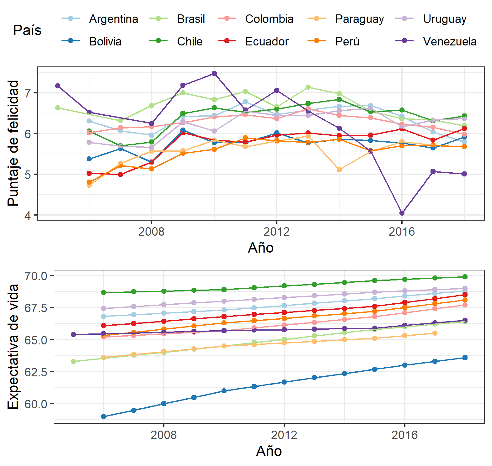  

Dia 3 - Gráfico de burbujas utilizando datos del World Happiness Report 2019  
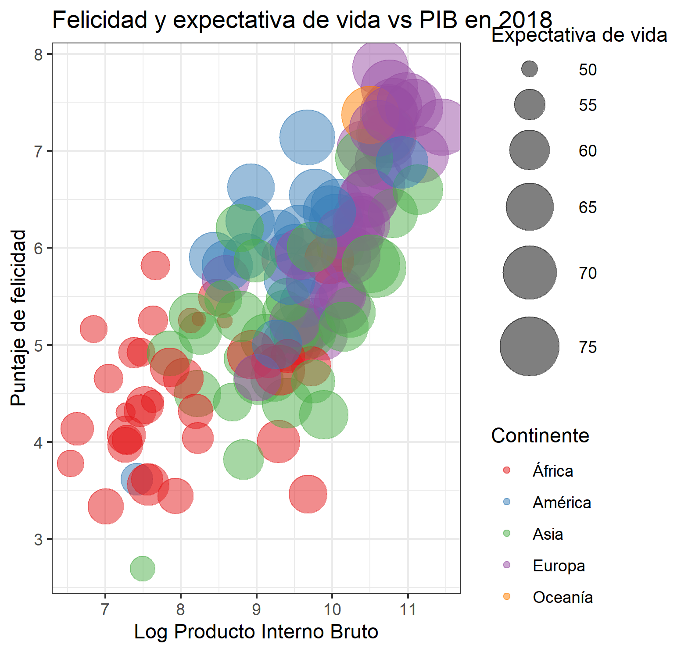  

Dia 4 - Gráfico de lineas con Facetas utilizando datos del Global Shark Attack File (GSAF)    
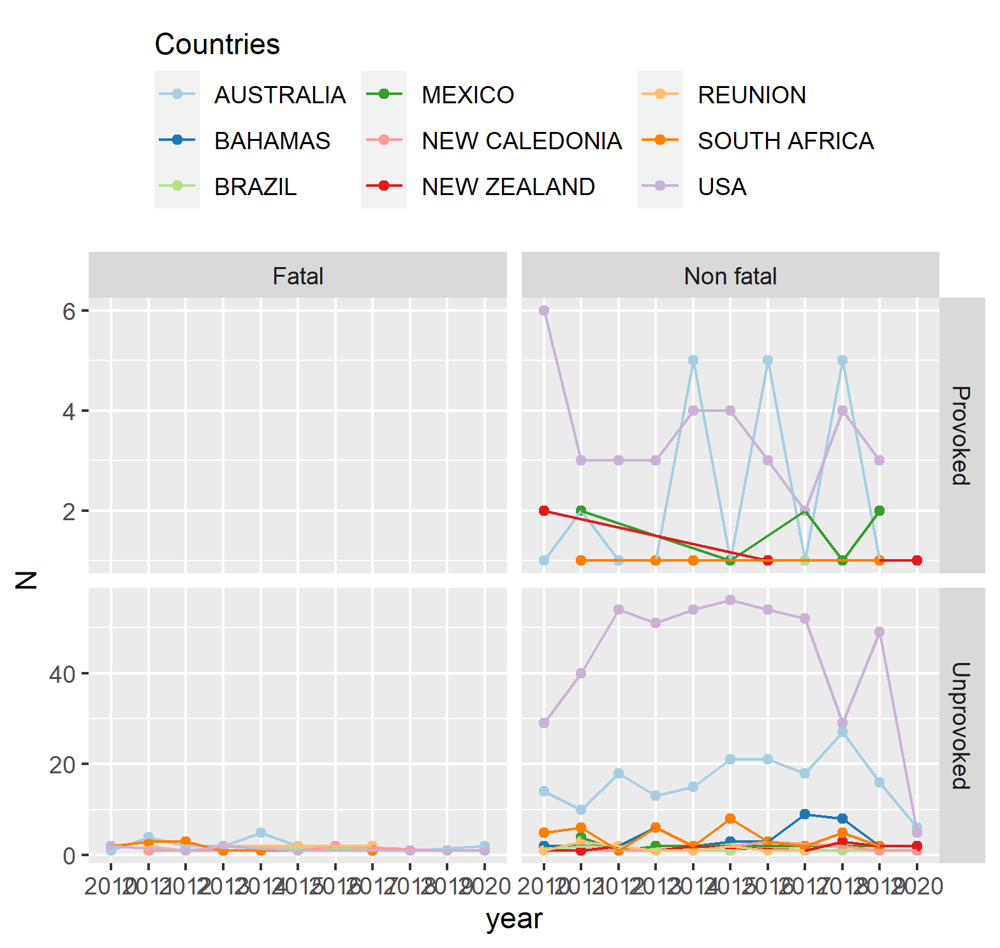 

Dia 5 - Diagrama de arco con datos INEC (Instituto Nacional de Estadistica y Censos del Ecuador)
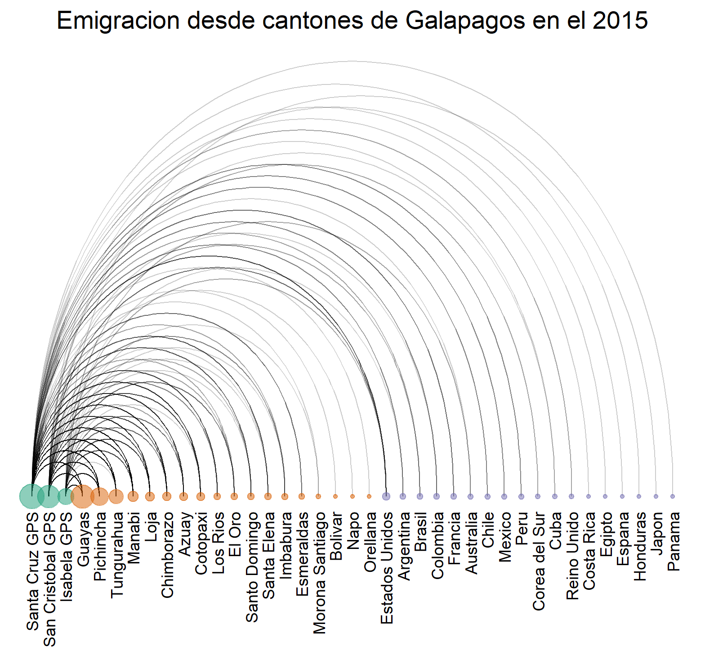 

Dia 6 - Diagrama interactivo de arco con datos INEC (Instituto Nacional de Estadistica y Censos del Ecuador)  
Ejemplo de diagrama presentado abajo. Vinculo para grafico interactivo debajo de figura.
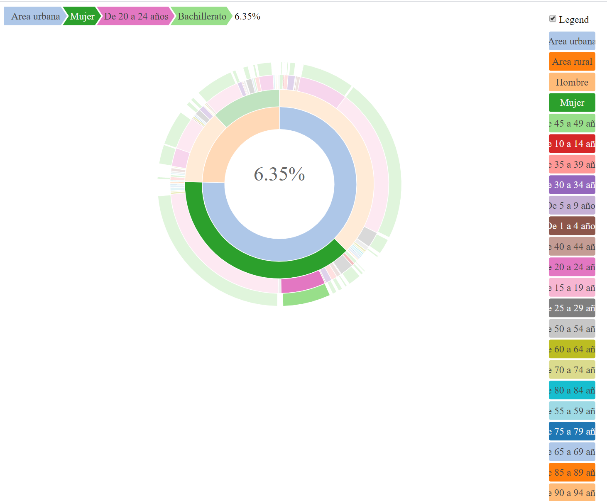
[Grafico interactivo disponible aqui]('./Outputs/Grafico6Donas.html')  

Dia 7 - Grafico ridgeline con datos INEC (Instituto Nacional de Estadistica y Censos del Ecuador)  
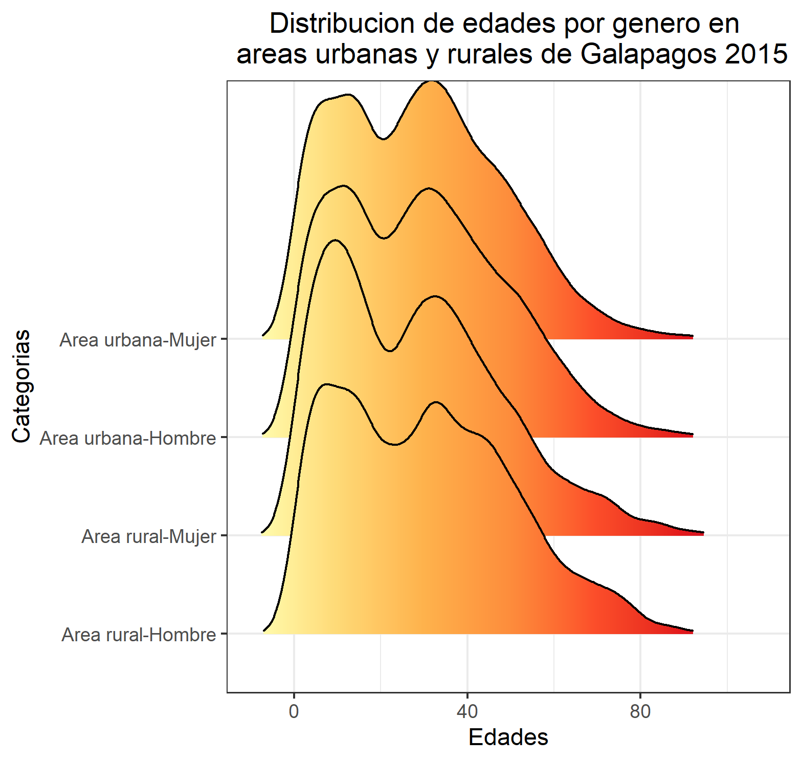  

Dia 8 - Grafico de contorno con datos de CTD obtenidos en el 2017  
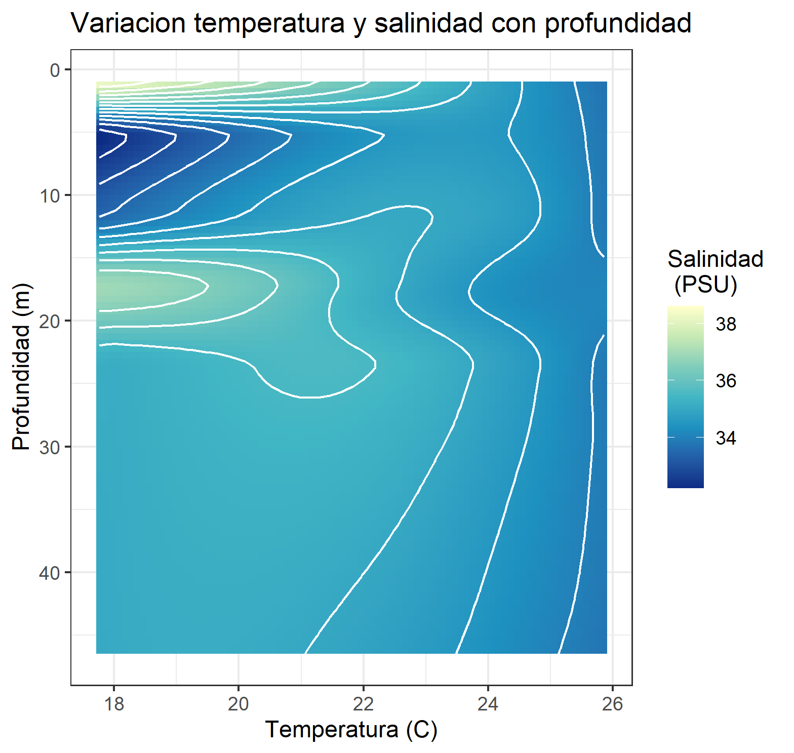  

Dia 9 - Grafico de areas apiladas con datos del Global Shark Attack File (GSAF) 
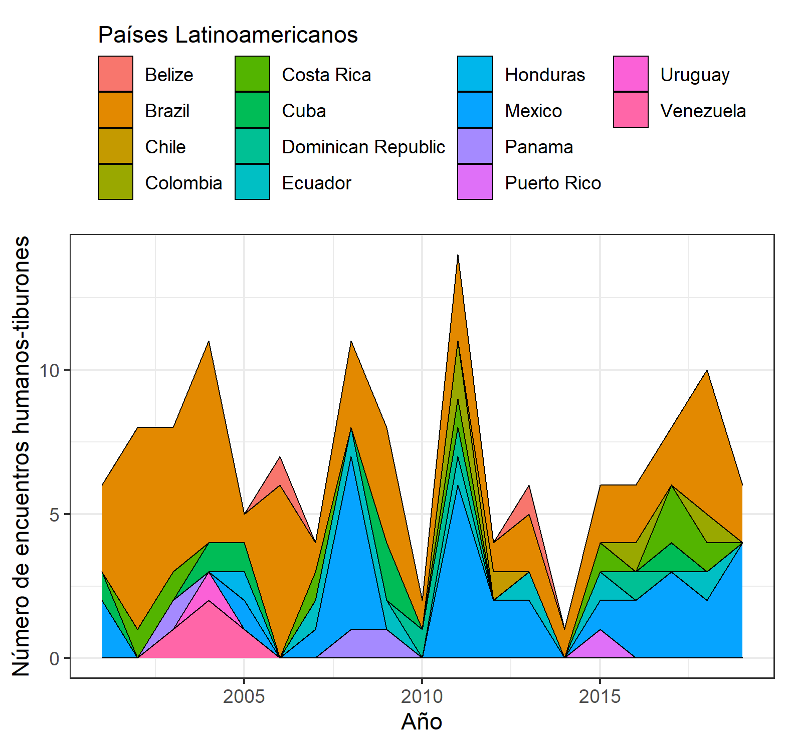  

Dia 10 - Explorando paletas de colores (unikn) con datos del Global Shark Attack File (GSAF) 
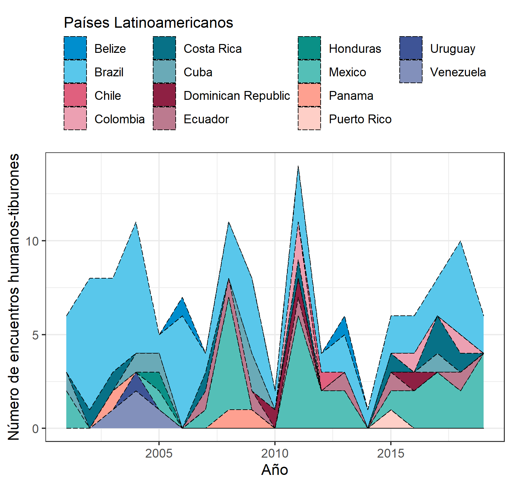  

Dia 11 - Mapa de calor con datos INEC (Instituto Nacional de Estadistica y Censos del Ecuador)  
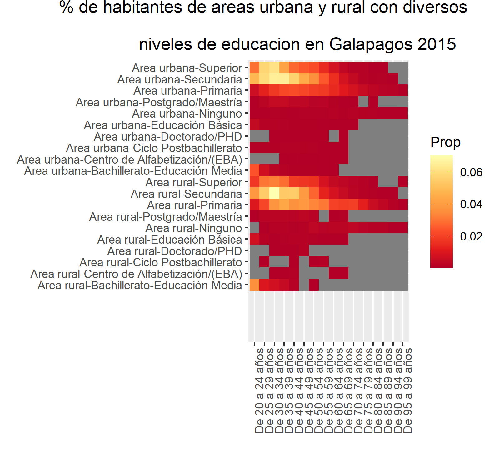  

Dia 12 - Grafico de paleta con datos del World Happiness Report 2019  
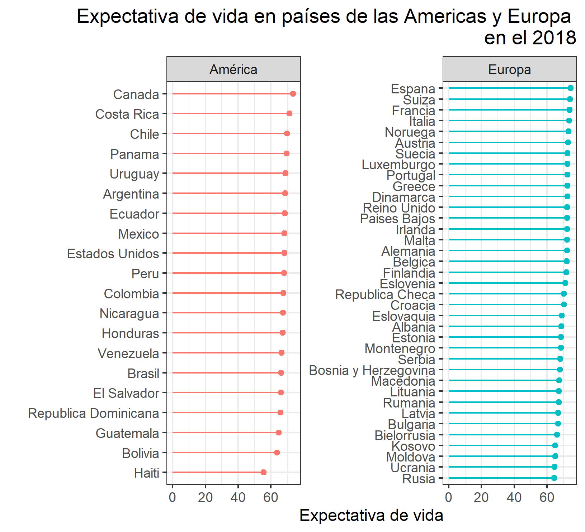  